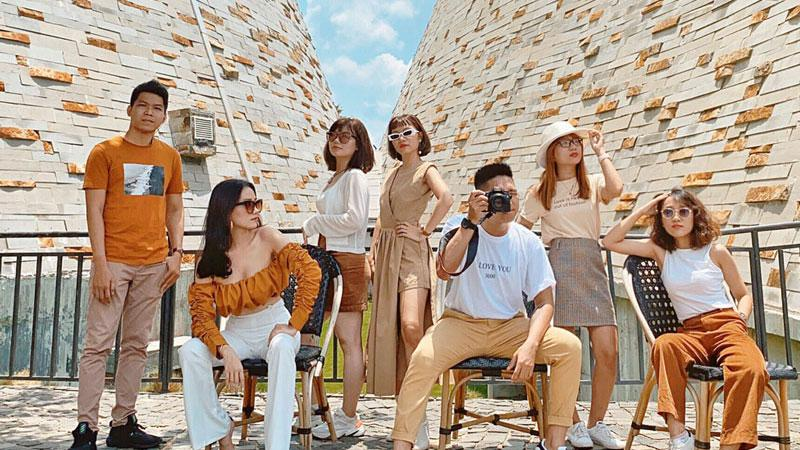
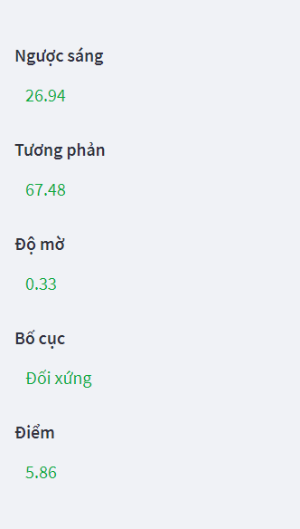
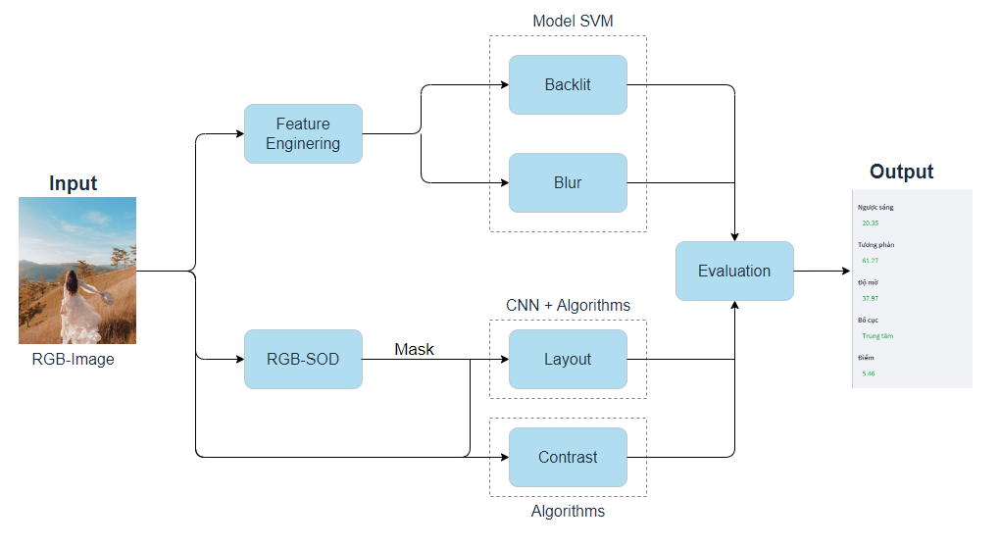

<div align="center">
  <h1> Assess Image Quality </h1>
</div>

## Description
A good photo is one where factors such as backlit, blur, contrast, and composition are well balanced, creating an aesthetically pleasing image. Specifically, a good photo should have the following characteristics:
+ **Backlight**: adjust the lighting appropriately to avoid shadows or glare on the subject in the photo. (0-100)
+ **Blur**: the photo should be taken clearly, without blur or blur. (0-100)
+ **Contrast**: increase the contrast in the image so that details are clearly distinguished, helping to increase bold, sharp dynamics. (0-100)
+ **Layout**: arrange the subjects in the frame so that it is harmonious, beautiful and creates a sense of sublimation for the viewer.
  - [Onethird](https://www.adobe.com/vn_en/creativecloud/photography/discover/rule-of-thirds.html#:~:text=What%20is%20the%20rule%20of,compelling%20and%20well%2Dcomposed%20shots.)
  - [Center](https://snapshot.canon-asia.com/article/eng/part-3-composition-basics-center-composition-and-symmetrical-composition#:~:text=Centre%20composition%3A%20The%20most%20powerful,middle%20of%20the%20image%20frame.)
  - [Symmetry](https://snapshot.canon-asia.com/article/eng/part-3-composition-basics-center-composition-and-symmetrical-composition#:~:text=Centre%20composition%3A%20The%20most%20powerful,middle%20of%20the%20image%20frame.)

The application will evaluate the image quality based on 4 criteria of backlit, contrast, blur and composition.

## Installation
#### Window
- Clone project
  ```
    git clone https://github.com/bdts1547/AssessImage.git
  ```
- Download, extract **[model_symmetry](https://drive.google.com/file/d/1O5nzjuWbkFM68sFY2qYj6uFI0H14FOkZ/view?usp=share_link)** and put it in the folder AssessImage.
  ```
  AssessImage
  |-- caffe
  |-- model
  |-- MODELS (here)
  |-- ...
  ```
- Create environment python 3.7.13 with **[Anaconda](https://www.anaconda.com/)** and install requirements
  ```
    conda create -n my_env python=3.7.13 -y
    conda activate my_env
    pip install -r requirements.txt
  ```
- Create environment python 2.7.18 with name "py27" to create sub shell for calling symmetry detection
  ```
    conda create -n py27 python=2.7.18 -y
    conda activate py27
    pip install matplotlib numpy scikit-image scipy protobuf
  ```


## Run

- Run with [streamlit](https://streamlit.io/)
  ```
    conda activate my_env
    streamlit run streamlit_app.py
  ```
  
## Demo
Input          |  Output
:-------------------------:|:-------------------------:
  |  

## Architecture


- **Backlit**: [feature extraction from YC<sub>B</sub>C<sub>R</sub> color space](https://www.spiedigitallibrary.org/conference-proceedings-of-spie/8292/1/Detection-of-backlight-images-using-chrominance/10.1117/12.906114.short?SSO=1), then feed into [SVM](https://en.wikipedia.org/wiki/Support_vector_machine) for backlit image quantification.
- **Blur**: use edge operators ([Sobel](https://en.wikipedia.org/wiki/Sobel_operator), [Robert](https://en.wikipedia.org/wiki/Roberts_cross), [Laplacian](https://en.wikipedia.org/wiki/Laplace_operator)) for feature extraction, then feed into [SVM](https://en.wikipedia.org/wiki/Support_vector_machine) for blur image quantification.
- **Contrast**: [an image whose pixel intensity distribution occupies less than 35% of domain [0, 255]](https://www.geeksforgeeks.org/detecting-low-contrast-images-with-opencv-scikit-image-and-python/) will be considered as low contrast image.
- **Layout**: 
  + **Onethird, Center**: use [TRACER](https://ojs.aaai.org/index.php/AAAI/article/view/21633) ([RGB Salient Object Detection](https://paperswithcode.com/task/salient-object-detection) model) to detect objects in the image, then determine the position of objects to find the appropriate composition.
  + **Symmetry**: use a method for measuring symmetry in images by [using filter responses from Convolutional Neural Networks (CNNs)](https://www.mdpi.com/2073-8994/8/12/144).
