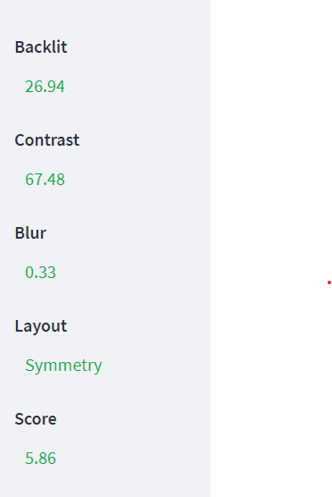

<div align="center">
  <h1> Assess Image Quality </h1>
</div>

## Description
A good photo is one where factors such as backlit, blur, contrast, and composition are well balanced, creating an aesthetically pleasing image. Specifically, a good photo should have the following characteristics:
+ Backlight: adjust the lighting appropriately to avoid shadows or glare on the subject in the photo. (0-100)
+ Blur: the photo should be taken clearly, without blur or blur. (0-100)
+ Contrast: increase the contrast in the image so that details are clearly distinguished, helping to increase bold, sharp dynamics. (0-100)
+ Layout: arrange the subjects in the frame so that it is harmonious, beautiful and creates a sense of sublimation for the viewer.
  - One-third
  - Center
  - Symmetry

The application will evaluate the image quality based on 4 criteria of backlit, contrast, blur nad layout.

## Installation
- Clone project
  ```
    git clone https://github.com/bdts1547/AssessImage.git
  ```
- Download, extract **[model_symmetry](https://drive.google.com/file/d/1O5nzjuWbkFM68sFY2qYj6uFI0H14FOkZ/view?usp=share_link)** and put it in the folder AssessImage.
  ```
  AssessImage
  |-- caffe
  |-- model
  |-- MODELS (here)
  |-- ...
  ```
- Create environment python 3.7.13 with **[Anaconda](https://www.anaconda.com/)** and install requirements
  ```
    conda create -n my_env python=3.7.13 -y
    conda activate my_env
    pip install -r requirements.txt
  ```
- Create environment python 2.7.18 with name "py27" to call symmetry detection
  ```
    conda create -n py27 python=2.7.18 -y
    conda activate py27
    pip install matplotlib numpy scikit-image scipy protobuf
  ```


## Run

- Run with streamlit
  ```
    conda activate my_env
    streamlit run streamlit_app.py
  ```
  
## Demo
Input          |  Output
:-------------------------:|:-------------------------:
  |  

## Architecture

